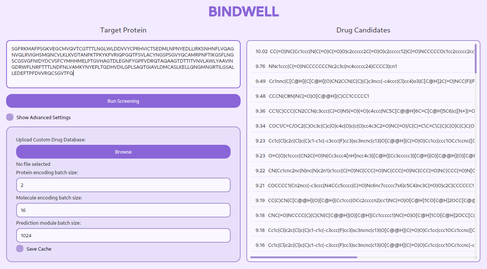
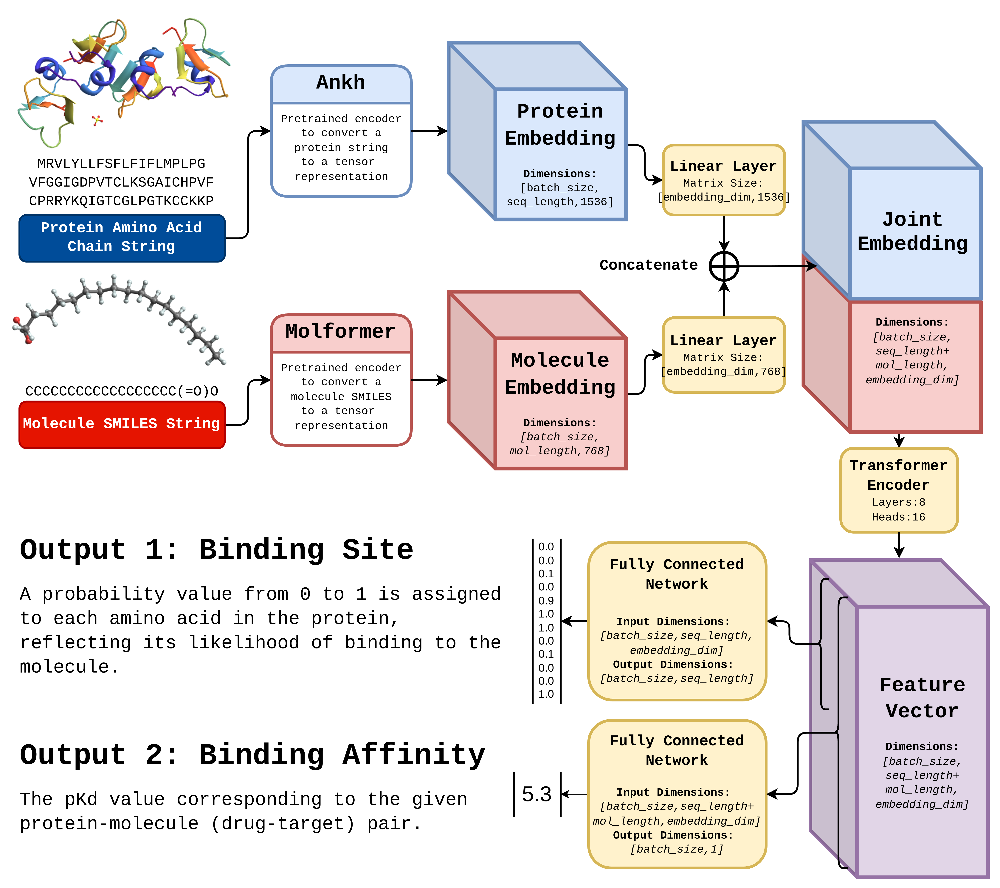

# **BINDWELL: The intelligent approach to therapeutic development, powered by AI**

[**Installation Instructions**](docs/Installation.md)

**Inspiration**
---------------

The exorbitant cost of prescription drugs in the US has become a crippling burden for millions of Americans. In 2020, the average American spent over $1,200 on prescription medications [1], with many more forced to choose between life-saving treatments and basic necessities. The consequences are dire: a staggering 1 in 5 Americans cannot afford their medications, leading to devastating health outcomes and even death [2]. The root of this crisis lies in the staggering cost of bringing a drug to market in the US - a whopping $2 billion and 15 years on average [3]. A significant portion of this expenditure is squandered on the inefficient and time-consuming process of high-throughput screening in drug discovery. By revolutionizing this process, we can reduce the financial burden on patients and make life-changing treatments more accessible. Bindwell was born from this urgent need, driven by the conviction that AI can transform the drug discovery process, making it faster, cheaper, and more effective.

**What's drug discovery?**: Drug discovery is the process of finding new medicines that target specific proteins in the body to treat or cure diseases. It starts with researchers screening thousands or millions of compounds to identify those that bind effectively to a particular protein, winnowing down millions of possible drugs to a few hundred promising leads. This incredibly labor-intensive and costly step is the most critical in the preclinical phase.

**What is Bindwell?**
---------------

Bindwell revolutionizes drug discovery through AI-powered virtual screening. Traditional drug discovery is slow and expensive, typically involving:

1. Lab-based high-throughput screening: physically testing millions of compounds to find what fits with a target protein.
2. Structure-based virtual screening: computationally docking compounds to 3D protein models.

Both methods are time-consuming, costly, and have limitations [4], such as requiring large amounts of time-prohibitive high quality 3D data and computational resources.

Bindwell's innovation: AffinityLM, our AI model that predicts drug-protein interactions with unprecedented speed and accuracy.

**Key features:**
1. Speed: Screens 700,000 compounds per second (vs. weeks for traditional methods).
2. Sequence-based: Works with any protein, no 3D structure needed.
3. Comprehensive: Predicts binding affinity rather than binary hits.
4. Data-rich: Trained on 20 million drug-protein pairs, the largest dataset ever used in the field.

**How it works:**
1. Input: Target protein sequence
2. Process: AI-based screening against a standard library of 500,000 drug-likely compounds
3. Output: Top 100 drug candidates with binding predictions

Bindwell aims to revolutionize pharmaceutical R&D, ultimately bringing life-saving drugs to market faster and more affordably.

**Bindwell's Accomplishments**
---------------------------------

* **Incredible Inference Time**: Screens ~700,000 molecules per second on consumer hardware, meaning it can screen the entire corpus of known organic chemicals (177 million) in just 4.5 minutes, a 242-year long process with traditional methods [5].
* **Successful Prediction of SARS-CoV-2 Inhibitors**: Predicted drug inhibitors for SARS-CoV-2 with 85% concordance with existing research [6].
* **State-of-the-art Accuracy**: Our AffinityLM model matches or surpasses the accuracy of industry models on multiple independant benchmarks.

**Impact**
---------------

Bindwell's approach to drug discovery offers incredible implications for healthcare and scientific research:

* **Rapid Response to Outbreaks**: Bindwell's sequence-only model enables immediate screening for new drugs, eliminating the need for time-consuming 3D data or physical compounds, allowing for rapid response to global pandemics and disease outbreaks.
* **Advancing Scientific Research**: Bindwell's novel model architecture addresses data scarcity issues, providing a viable path to overcome longstanding data availability challenges in the field, and advancing scientific research.
* **Cost and Time Savings**: Bindwell's approach offers a nearly 100% cost reduction compared to traditional methods ([such as](https://www.colorado.edu/lab/hts/rates)), while screening thousands of times more compounds, ultimately leading to faster and cheaper access to medication for people.

**Building Bindwell**
-------------------

We developed Bindwell's AffinityLM model by training it on a dataset of 20 million drug-target pairs from BindingDB and Uniprot, the largest dataset ever used for this task. AffinityLM uses two language models to encode protein and ligand sequences, followed by linear transformations, concatenation, self-attention, and two prediction heads for binding affinity and site (Pictured above). We implemented AffinityLM in PyTorch, trained it in 39 hours on consumer hardware, and created a user-friendly frontend with PyQT5. Bindwell and AffinityLM represent a significant milestone in AI-driven drug discovery, with the potential to the field.

**Challenges Bindwell Faced**
-----------------------

* **Data Scarcity and Overfitting**: With only 2 million publically available binding affinities, to prevent overfitting, we developed the AffinityLM architecture to leverage the 18 million protein-ligand binding sites, enabling a small model without sacrificing accuracy.
* **Model Optimization**: Balancing model size and hyperparameters was a significant challenge. We iterated through three models, starting small and scaling up, to avoid sacrificing accuracy for efficiency or vice versa.
* **Effective Caching**: With large molecular embeddings and multiple devices (CPU and CUDA GPU) for inference, to maximize inference times, we had to develop an memory efficient caching method. We made a simple flexible caching strategy that selectively moves data between DRAM and VRAM as needed, though there's still room for improvement. 

**Looking Forward**
---------------------------

We're all deeply committed to contributing to the field of AI-driven drug discovery, and to further accelerate its progress, we plan to publish a research paper detailing our approach in developing AffinityLM. By sharing our work with the scientific community, we also hope to to foster more collaboration and innovation in the pursuit of life-changing therapies, especially admist an AI revolution.

### References:

[1] IQVIA Institute for Human Data Science. (2020). The Use of Medicines in the United States: Review of 2020.

[2] National Opinion Research Center (NORC) at the University of Chicago. (2020). Medication Adherence in America: A National Report Card.

[3] DiMasi, J. A., Grabowski, H. G., & Hansen, R. W. (2014). Cost of developing a new drug. Journal of Health Economics, 47, 20-33.

[4] Kolb, P., & Caflisch, A. (2006). Automatic docking and pharmacophore discovery. Journal of Medicinal Chemistry, 49(24), 7384-7392.

[5] Kolukisaoglu, H. U. (2010). High-throughput screening. In Encyclopedia of Industrial Biotechnology: Bioprocess, Bioseparation, and Cell Technology (pp. 1-13). John Wiley & Sons, Inc.

[6] Beck, B. R., Shin, B., Choi, Y., Park, S., & Kang, K. (2020). Predicting commercially available antiviral drugs that may be effective against the COVID-19 virus. Journal of Medical Virology, 92(6), 911-920.
